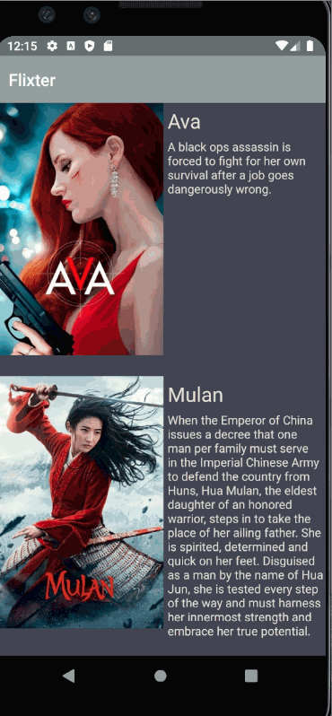
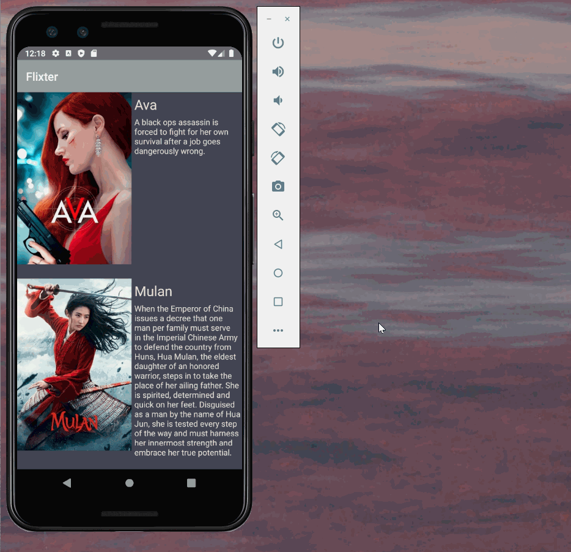
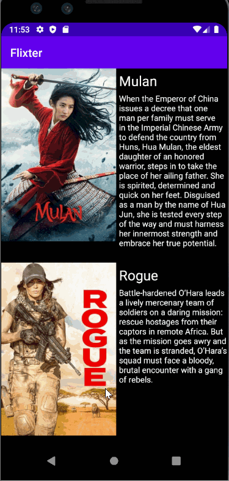

# Flix
Flix is an app that allows users to browse movies from the [The Movie Database API](http://docs.themoviedb.apiary.io/#).
## Flix Part 2

### User Stories

#### REQUIRED (10pts)

- [x] (8pts) Expose details of movie (ratings using RatingBar, popularity, and synopsis) in a separate activity.
- [x] (2pts) Allow video posts to be played in full-screen using the YouTubePlayerView.

#### BONUS

- [ ] Trailers for popular movies are played automatically when the movie is selected (1 point).
  - [ ] When clicking on a popular movie (i.e. a movie voted for more than 5 stars) the video should be played immediately.
  - [ ] Less popular videos rely on the detailed page should show an image preview that can initiate playing a YouTube video.
- [ ] Add a play icon overlay to popular movies to indicate that the movie can be played (1 point).
- [ ] Apply the popular ButterKnife annotation library to reduce view boilerplate. (1 point)
- [ ] Add a rounded corners for the images using the Glide transformations. (1 point)

### App Walkthough GIF

Here's a walkthrough of implemented user stories I did during week 2 of FLixter work:

The first gif shows the move from the main screen to the movie detail screen with YoutubePlayerView working

The second gif shows implementing the portrait/landscape flipping orientation stretch story from part 1

### Notes

Describe any challenges encountered while building the app:

I definitely utilized the git rollback functionality this week, as I had inadvertantly created a blank activity instead of an empty activity when creating my detail view.  It ended up creating compiler errors, and was easiest to simply roll back to the previous save and restart, using the correct empty activity.

I had fun this week creating a color theme and updating the UI with it.  I also went back and added some stretch stories from last week, such as the different views for different orientations, which was surprisingly easy.  I would consider this week's adds more work than last week, but they made more sense, and I really feel like I understand the concepts this week.

I also went back and created a separate untracked xml for the API keys as mentioned in some of the reading under the resources tab.  I had trouble with the previous repository containing older files with the API keys hard-coded and present in plain text in the previous commit files, so I made that repository private and created a new repository with no hard-coded API keys.

## Open-source libraries used
- [Android Async HTTP](https://github.com/codepath/CPAsyncHttpClient) - Simple asynchronous HTTP requests with JSON parsing
- [Glide](https://github.com/bumptech/glide) - Image loading and caching library for Android

---

## Flix Part 1

### User Stories

#### REQUIRED (10pts)
- [x] (10pts) User can view a list of movies (title, poster image, and overview) currently playing in theaters from the Movie Database API.

#### BONUS
- [x] (2pts) Views should be responsive for both landscape/portrait mode.
   - [x] (1pt) In portrait mode, the poster image, title, and movie overview is shown.
   - [x] (1pt) In landscape mode, the rotated alternate layout should use the backdrop image instead and show the title and movie overview to the right of it.

- [ ] (2pts) Display a nice default [placeholder graphic](https://guides.codepath.org/android/Displaying-Images-with-the-Glide-Library#advanced-usage) for each image during loading
- [x] (2pts) Improved the user interface by experimenting with styling and coloring.
- [ ] (2pts) For popular movies (i.e. a movie voted for more than 5 stars), the full backdrop image is displayed. Otherwise, a poster image, the movie title, and overview is listed. Use Heterogenous RecyclerViews and use different ViewHolder layout files for popular movies and less popular ones.

### App Walkthough GIF
Here's a walkthrough of implemented user stories:

### Notes
Describe any challenges encountered while building the app:  
My biggest challenge when creating this app was understanding the RecyclerView setup.  Understanding how the adapter and layout manager interact is not self-explanatory.  I feel as though when things incorporate multiple files, it can be hard to follow the flow of information and understand what is being called where.

### Open-source libraries used

- [Android Async HTTP](https://github.com/codepath/CPAsyncHttpClient) - Simple asynchronous HTTP requests with JSON parsing
- [Glide](https://github.com/bumptech/glide) - Image loading and caching library for Androids
